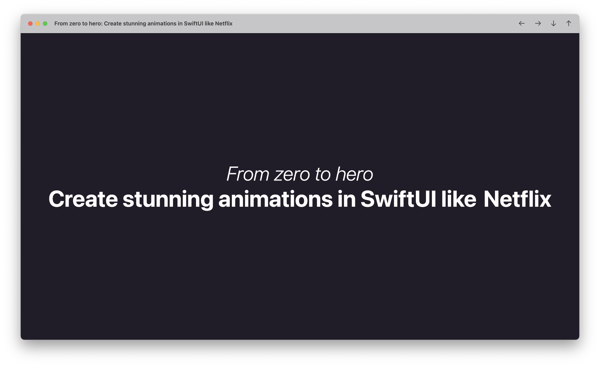

This repository contains the slide deck of my talk about SwiftUI Animations \
at the shared Mobile Developer Meeting of [Joyn](https://www.joyn.de/) and [Netlight](https://www.netlight.com/)

The slidedeck is a SwiftUI MacOS app created with [DeckUI](https://github.com/joshdholtz/DeckUI).

## Demo App - Stream Seeker

For this talk I created _StreamSeeker_, a movie collection app.
